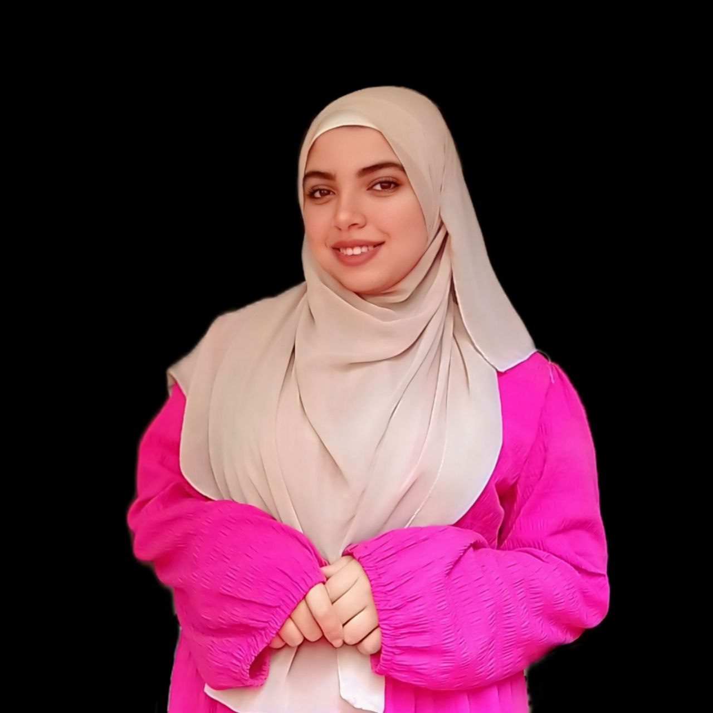

<!DOCTYPE html><html lang="en" dir="rtl"><head>
  <meta charset="UTF-8" />
  <meta name="viewport" content="width=device-width, initial-scale=1.0" />
  <title>بورتفليو المهندسة منة الله سعيد</title>
  <link rel="stylesheet" href="https://cdnjs.cloudflare.com/ajax/libs/font-awesome/6.4.0/css/all.min.css" />
  <link href="https://cdn.jsdelivr.net/npm/aos@2.3.4/dist/aos.css" rel="stylesheet">
  <link href="https://fonts.googleapis.com/css2?family=Cairo:wght@400;700&family=Poppins:wght@400;700&display=swap" rel="stylesheet">
  
</head>
<body>
  <header>
    <h1>المهندسة منة الله سعيد | Eng. Menna Allah Said</h1>
     
    <nav>
      <a href="#about">عني/ About Me</a>
      <a href="#courses">الدورات / Courses</a>
      <a href="#feedback">آراء / Feedback</a>
      <a href="#contact">تواصل / Contact</a>
    </nav>
  </header>  <section id="about" data-aos="fade-up">
    <h2>عنّي | About Me</h2>  
     
أنا منة الله سعيد، مهندسة برمجيات بخبرة سنة ونصف في التعليم أونلاين
         بعلم الكبار والصغار أساسيات الكمبيوتر، وكمان لغات البرمجة زي 
         HTML، CSS، JavaScript، وC++، وأساسيات لغة بايثون. بدرس مادة 
        
        ICT بالعربي واللغات للابتدائي والإعدادي.

I'm Menna Allah Said, a software engineer with 1.5 years of online teaching experience.
      I teach both kids and adults computer fundamentals and programming languages 
     like HTML, CSS, JavaScript, C++, and Python basics.

  </section>  <section id="courses" data-aos="fade-left">
    <h2>الدورات التي أقدمها / My Courses</h2>
    <ul>
      <li>أساسيات الكمبيوتر (للكبار والصغار) / Computer Basics (for kids and adults)</li>
      <li>برمجة الويب: HTML, CSS, JavaScript / Web Development</li>
      <li>C++ Programming</li>
      <li>Python Basics</li>
      <li>مادة ICT بالعربي واللغات للمرحلتين الابتدائية والإعدادية / ICT Subject for Primary and Prep students</li>
    </ul>
  </section>  <section id="feedback" data-aos="zoom-in">
    <h2>آراء الطلاب وأولياء الأمور / Students & Parents Feedback</h2>
    

      
      
      
      
      
      
      
      
      
      
      
      
      
      
      
      
      
      
    

  </section>  <section id="lessons" data-aos="flip-left">
    <h2>نماذج من الدروس / Sample Lessons</h2>
    <video src="للتواصل  01093064987.mp4" controls></video>
    <video src="تنفيذ الطلاب مع المهندسه منة الله سعيد.mp4" controls></video>
  </section>  <section id="contact" class="contact"data-aos="fade-up">
    <h2>تواصل معي / Contact Me</h2>
    
رقم الهاتف / Phone: 01093064987

    
الإيميل / Email: menna@example.com

  </section>  

    ↑
  
    </body>
</html>
  

